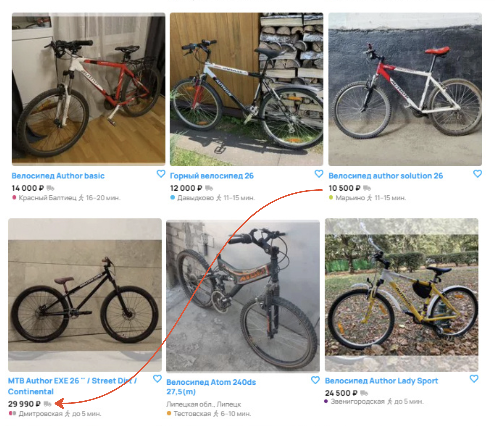
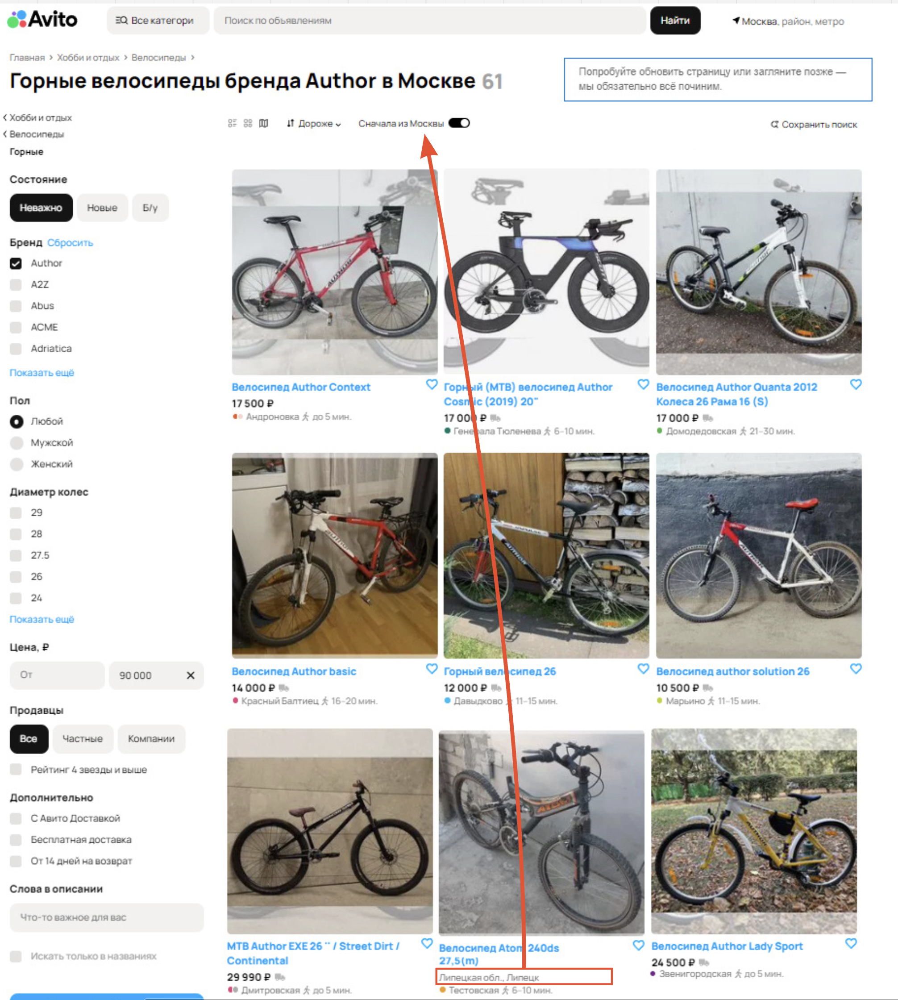

# Баг-репорт АВИТО

| ID | Summary                                                                                | Severity            | Priority     | Status | Steps to Reproduce                                                                                                                                                                                                                                                                                                                                                                                                | Expected Result                                                                                                                                                                                                     | Actual result                                                                                                                                                                            | Description                                                                                                                                                                            | Attachment                                                                                      | Annotation                                                                                                                                                                                                                                                     |
| -- | -------------------------------------------------------------------------------------- | ------------------- | ------------ | ------ | ----------------------------------------------------------------------------------------------------------------------------------------------------------------------------------------------------------------------------------------------------------------------------------------------------------------------------------------------------------------------------------------------------------------- | ------------------------------------------------------------------------------------------------------------------------------------------------------------------------------------------------------------------- | ---------------------------------------------------------------------------------------------------------------------------------------------------------------------------------------- | -------------------------------------------------------------------------------------------------------------------------------------------------------------------------------------- | ----------------------------------------------------------------------------------------------- | -------------------------------------------------------------------------------------------------------------------------------------------------------------------------------------------------------------------------------------------------------------- |
| 1  | Отсутствие отображения header с кнопками навигации на сайте                            | S2 - Критический    | P1 - Высокий | Открыт | 1. Открыть страницу каталога товаров на сайте. 2. Проверить наличие кнопок Личный Кабинет, Избранное, Корзина в верхней панели.                                                                                                                                                                                                                                                                              | Верхняя панель должна отображать кнопки навигации, включая Личный Кабинет, Избранное, Корзина и др.                                                                                                                 | Кнопки навигации, такие как Личный Кабинет, Избранное и Корзина, не отображаются в header, что затрудняет доступ к этим функциям.                                                        | Несмотря на наличие возможности добавить товар в Избранное, пользователю невозможно просмотреть свой список избранных товаров, так как отсутствует кнопка для перехода в этот раздел.  |         | Будем предполагать, что header отсутствует вовсе, а не его нет на скриншоте. :)  Был выбран высокий приоритет и критическая критичность, баг серьёзно ухудшает юзабилити сайта, что приводит к бизнес-потерям.                                         |
| 2  | Некорректная сортировка товаров по убыванию цены при выборе опции "Дороже"             | S3 - Значительный   | P1 - Высокий | Открыт | 1. Открыть страницу каталога горных велосипедов на сайте. 2. В панели сортировки выбрать вариант "Дороже". 3. Обратить внимание на порядок отображения товаров.                                                                                                                                                                                                                                         | При выборе сортировки "Дороже" товары должны отображаться в порядке убывания цены – от самого дорогого к самому дешевому без сбоев в последовательности.                                                            | Сортировка корректна только для первых 6 элементов, после чего порядок сбивается: товары снова начинают сортироваться по убыванию.                                                       | Баг может приводить к путанице у пользователей и усложнять выбор товаров.                                                                                                              |        | Был выбран высокий приоритет и значительная критичность, баг не мешает работе основного функционала, но вводит в заблуждение юзеров.                                                                                                                           |
| 3  | Некорректное количество страниц в пагинации при выводе товаров по запросу              | S3 - Значительный   | P1 - Высокий | Открыт | 1. Открыть страницу каталога товаров на сайте. 2. Ввести в поисковую строку запрос, который должен вернуть меньше количества товаров, отображаемых на 100 страницах. 3. Обратить внимание на количество найденных товаров, указанное в результатах поиска. 4. Убедиться, что блок пагинации работает исправно, то есть количество страниц соответсвует (количеству товаров / лимит на 1 страниц).  | Если найдено 61 товар, а на одной странице отображается 12 товаров, система должна корректно рассчитывать количество страниц – в данном случае 6 страниц (5 полных страниц по 12 товаров и 1 страница с 1 товаром). | Пагинация отображает 100 страниц, что невозможно при найденных 61 товаре. Количество страниц в выдаче не соответствует количеству товаров, что может вводить пользователя в заблуждение. | Система пагинации работает неисправно, что может привести к некорректной навигации по каталогу и ухудшению пользовательского опыта.                                                    |       | Невозможно проверить, что содержится на страницах 7-100, будем преполагать, что они пустые.   Был выбран высокий приоритет и значительная критичность, баг вызывает проблемы с отображением товаров и пагинации страниц.                               |
| 4  | Некорректная фильтрация по бренду в поиске товаров                                     | S3 - Значительный   | P2 - Средний | Открыт | 1. Открыть страницу каталога горных велосипедов на сайте. 2. В панели фильтров выбрать Бренд: Author. 3. Просмотреть список выдачи и убедиться, что среди велосипедов Author присутствует велосипед Atom. 4. Проверить, повторяется ли ошибка при обновлении страницы или повторном применении фильтра.                                                                                            | При выборе фильтра "Бренд: Author" в поисковой выдаче должны отображаться только горные велосипеды бренда Author, без товаров других брендов.                                                                       | Cреди результатов поиска присутствует один велосипед бренда Atom, что нарушает корректность фильтрации.                                                                                  | Неисправная система фильтрации может вводить пользователя в заблуждение, снижать доверие к фильтрам и усложнять процесс поиска нужного товара.                                         |      | Был выбран средний приоритет и значительная критичность,  баг не мешает работе основного функционала, однако мешает взаимодействию юзеров и фильтров.                                                                                                          |
| 5  | Некорректное отображение выбранного способа представления товаров на странице каталога | S4 - Незначительный | P2 - Средний | Открыт | 1. Открыть страницу каталога горных велосипедов на сайте. 2. В панели выбора способа отображения выбрать вариант ""Сетка"". 3. Обратить внимание на представление товаров на странице и на активный вариант в панели выбора.                                                                                                                                                                            | При выборе способа отображения "Сетка" товары отображаются в сетке, а соответствующая икнока в панели выбора должна быть выделена.                                                                                  | Товары отображаются в формате "Сетка", но панель выбора показывает активным вариант "На Карте".                                                                                          | Ошибка вводит пользователя в заблуждение и может повлиять на взаимодействие с каталогом.                                                                                           |        | В контексте баг-репорта предполагается, что отображение товаров "На карте" исправно работает, некорректно отображается только иконка "Сетка".  Был выбран средний приоритет и незначительная критичность, баг не мешает работе основного функционала.  |
| 6  | Нарушение порядка сортировки при выборе опции "Сначала из Москвы"                      | S4 - Незначительный | P2 - Средний | Открыт | 1. Открыть страницу каталога горных велосипедов на сайте. 2. В параметрах сортировки выбрать опцию "Сначала из Москвы". 3. Просмотреть список выдачи и обратить внимание на географическое расположение товаров. 4. Пролистать результаты поиска до середины списка. Найти товар, который не относится к Москве (например, из Липецка), и зафиксировать его позицию.                           | При выборе опции "Сначала из Москвы" товары из Москвы должны отображаться в начале списка и следовать непрерывным блоком, после чего должны идти товары из других регионов.                                         | Среди товаров из Москвы в середине списка отображается один товар из Липецка, после чего снова идут товары из Москвы. Это нарушает ожидаемый порядок сортировки.                         | Ошибка вводит пользователей в заблуждение, так как нарушается логика сортировки и отображения результатов.                                                                             |          | Был выбран средний приоритет и незначительная критичность, баг не мешает работе основного функционала.                                                                                                                                                         |
| 7  | Отсутствие информации о цене в карточке товара без указанной стоимости                 | S4 - Незначительный | P3 - Низкий  | Открыт | 1. Открыть страницу каталога товаров на сайте. 2. Найти товар, у которого не указана цена. 3. Убедиться, что строка с ценой отсутствует.                                                                                                                                                                                                                                                                | Если цена товара не указана, в описании товара должно быть четкое обозначение, например "Цена не указана".                                                                                                          | В описании товара соответствующее поле отсутствует.                                                                                                                                      | Баг может затруднить понимание, является ли это технической ошибкой или умышленным отсутствием информации о стоимости.                                                                 |     | Был выбран низкий приоритет и незначительная критичность,  баг не мешает работе основного функционала.                                                                                                                                                         |
| 8  | Некорректное отображение breadcrumbs                                                   | S4 - Незначительный | P3 - Низкий  | Открыт | 1.Открыть главную страницу сайта. 2. Перейти в раздел Хобби и отдых. 3. Выбрать категорию Велосипеды. 4. Перейти в подкатегорию Горные велосипеды. 5. Обратить внимание на отображение иерархии разделов в верхней части страницы.                                                                                                                                                            | При нахождении в разделе "Горные велосипеды" должна корректно отображаться вложенность: Главная › Хобби и отдых › Велосипеды › Горные                                                                           | Отображение некорректно: Главная › Хобби и отдых › Велосипеды Отсутствует последний уровень вложенности "Горные".                                                                | Некорректная иерархия разделов может создавать неудобства для пользователей при навигации по каталогу.                                                                                 |      | Был выбран низкий приоритет и незначительная критичность,  баг не мешает работе основного функционала.                                                                                                                                                         |
| 9  | Опечатка в кнопке "Все категории"                                                      | S5 - Тривиальный    | P3 - Низкий  | Открыт | 1. Открыть страницу каталога товаров на сайте. 2. Найти кнопку с текстом "Все категори" в верхней панеле. 3. Обратить внимание на текст на кнопке, убедившись, что он содержит опечатку в слове "категории".                                                                                                                                                                                            | Текст на кнопке должен быть правильно написан: "Все категории".                                                                                                                                                     | На кнопке написано "Все категори", что является опечаткой.                                                                                                                               | Это является незначительной ошибкой в интерфейсе, однако может повлиять на восприятие качества сайта пользователями.                                                                   |   | Был выбран низкий приоритет и тривиальная критичность,  баг не мешает работе основного функционала.                                                                                                                                                            |
